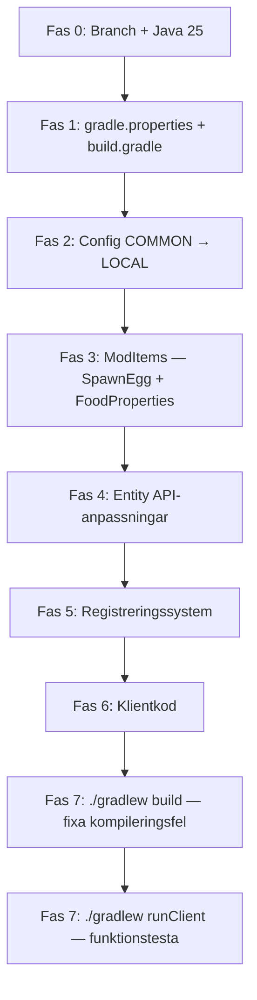

# HugoBOSS → NeoForge 26.3.0.40 Uppgraderingsplan

> Uppgradering från **NeoForge 21.1.230** (MC 1.21.1) → **NeoForge 26.3.0.40-beta** (MC 26.3)

---

## Översikt

| Nuvarande | Mål |
|---|---|
| Minecraft 1.21.1 | Minecraft 26.3 ("Wilderness Bound") |
| NeoForge 21.1.230 | NeoForge 26.3.0.40-beta |
| Java 21 | Java 25 |
| ModDevGradle 2.0.141 | ModDevGradle 2.0.147+ |
| Gradle 9.2.1 | Gradle 9.2.1 (bör fungera) |

---

## Fas 0 — Förberedelse

### 0.1 Skapa ny branch
```bash
git checkout -b mc-26.3
```

### 0.2 Säkerställ Java 25
- Verifiera att Java 25 JDK finns installerat
- Uppdatera `java.toolchain.languageVersion` i `build.gradle`

---

## Fas 1 — Build-system & metadata

### 1.1 `gradle.properties` — uppdatera versioner
| Property | Gammalt | Nytt |
|---|---|---|
| `minecraft_version` | `1.21.1` | `26.3` |
| `minecraft_version_range` | `[1.21.1]` | `[26.3]` |
| `neo_version` | `21.1.230` | `26.3.0.40-beta` |
| `loader_version_range` | `[1,)` | `[1,)` (behåll) |
| `parchment_minecraft_version` | `1.21.1` | `26.3` |
| `parchment_mappings_version` | `2024.11.17` | Senaste tillgänglig för 26.3 |
| `mod_version` | `2.0.5` | `3.0.0` (ny major) |

### 1.2 `build.gradle` — uppdatera plugin
```groovy
// Rad 4: Uppgradera ModDevGradle
id 'net.neoforged.moddev' version '2.0.147'
```

```groovy
// Rad 38: Uppgradera Java toolchain
java.toolchain.languageVersion = JavaLanguageVersion.of(25)
```

### 1.3 `neoforge.mods.toml`
- Inga strukturella ändringar krävs — mallsyntaxen (`${mod_id}` etc.) fungerar fortfarande

---

## Fas 2 — Config-system (Breaking change)

> [!WARNING]
> `ModConfig.Type.COMMON` har döpts om till `ModConfig.Type.LOCAL` i NeoForge 26.3.0.37+

### 2.1 [Config.java](file:///home/hans/HugoBOSS/src/main/java/net/hans/hugoboss/Config.java)
- Inga förändringar i `ModConfigSpec`-koden behövs — den API:n är oförändrad

### 2.2 [HugoBOSS.java](file:///home/hans/HugoBOSS/src/main/java/net/hans/hugoboss/HugoBOSS.java) rad 112
```java
// GAMMALT:
modContainer.registerConfig(ModConfig.Type.COMMON, Config.SPEC);

// NYTT:
modContainer.registerConfig(ModConfig.Type.LOCAL, Config.SPEC);
```

---

## Fas 3 — Item API-ändringar

### 3.1 `DeferredSpawnEggItem` borttagen
> [!IMPORTANT]
> `DeferredSpawnEggItem` finns inte längre i NeoForge 26.3. Ersätts med vanilla `SpawnEggItem`.

**Fil:** [ModItems.java](file:///home/hans/HugoBOSS/src/main/java/net/hans/hugoboss/item/ModItems.java)

Alla 6 spawn eggs behöver uppdateras:
```java
// GAMMALT:
import net.neoforged.neoforge.common.DeferredSpawnEggItem;
() -> new DeferredSpawnEggItem(ModEntities.MEGA_CREEPER, 0x0DA70B, 0xFF0000, new Item.Properties())

// NYTT:
import net.minecraft.world.item.SpawnEggItem;
() -> new SpawnEggItem(ModEntities.MEGA_CREEPER.get(), new Item.Properties())
```

> [!NOTE]
> Vanilla `SpawnEggItem` i 26.3 hanterar färger via Data Components istället för konstruktor-parametrar. Vi kan behöva använda `.component()` på `Item.Properties` för att sätta äggfärgerna — verifiera mot vanilla API vid implementation.

### 3.2 `FoodProperties` → komponentbaserat system
**Fil:** [HugoBOSS.java](file:///home/hans/HugoBOSS/src/main/java/net/hans/hugoboss/HugoBOSS.java) rad 66-67

```java
// GAMMALT:
new Item.Properties().food(new FoodProperties.Builder()
    .alwaysEdible().nutrition(1).saturationModifier(2f).build())

// NYTT (26.3 komponentmodell):
new Item.Properties()
    .food(new FoodProperties.Builder().nutrition(1).saturationModifier(2f).build(),
          ConsumableComponents.food().build())
```
- `alwaysEdible()` kan ha flyttats till `ConsumableComponent` — verifiera

### 3.3 `InteractionResultHolder` → möjligt borttagen
**Fil:** [TntStaffItem.java](file:///home/hans/HugoBOSS/src/main/java/net/hans/hugoboss/item/TntStaffItem.java)
- Kontrollera om `InteractionResultHolder` fortfarande finns eller om `use()` nu returnerar `InteractionResult` direkt

---

## Fas 4 — Entity-system

### 4.1 Entity Builder
**Fil:** [ModEntities.java](file:///home/hans/HugoBOSS/src/main/java/net/hans/hugoboss/entity/ModEntities.java)

Kontrollera att `EntityType.Builder.of(...).sized(...).build("name")` fortfarande tar en String-parameter. I nyare versioner kan `build()` ha ändrats till att ta en `ResourceKey` istället.

### 4.2 `Entity.MoveFunction`
**Fil:** [SeaSerpentEntity.java](file:///home/hans/HugoBOSS/src/main/java/net/hans/hugoboss/entity/SeaSerpentEntity.java) rad 186
```java
public void positionRider(Entity passenger, Entity.MoveFunction moveFunction)
```
- Verifiera att `MoveFunction` fortfarande finns i 26.3

### 4.3 NBT / CompoundTag
**Fil:** [GiantEagleEntity.java](file:///home/hans/HugoBOSS/src/main/java/net/hans/hugoboss/entity/GiantEagleEntity.java) rad 224-235
- `addAdditionalSaveData` / `readAdditionalSaveData` med `CompoundTag` — kontrollera om detta har migrerats till Data Components

### 4.4 `SynchedEntityData.Builder`
**Fil:** [GiantEagleEntity.java](file:///home/hans/HugoBOSS/src/main/java/net/hans/hugoboss/entity/GiantEagleEntity.java) rad 61
- `defineSynchedData(SynchedEntityData.Builder)` signaturen kan ha ändrats

---

## Fas 5 — Registreringssystem

### 5.1 DeferredRegister
- `DeferredRegister`, `DeferredBlock`, `DeferredItem`, `DeferredHolder` — verifiera att API:t är oförändrat
- NeoForge 26.3 har tagit bort obfuskering helt — parameter-namn i vanilla-klasser är nu officiella

### 5.2 BiomeModifier serializers
**Fil:** [HugoBOSS.java](file:///home/hans/HugoBOSS/src/main/java/net/hans/hugoboss/HugoBOSS.java) rad 53-58
- `NeoForgeRegistries.Keys.BIOME_MODIFIER_SERIALIZERS` — verifiera att nyckeln finns kvar

### 5.3 Biome Modifier data-filer
**Mapp:** `src/main/resources/data/hugoboss/neoforge/biome_modifier/`
- 6 JSON-filer — kontrollera att schemat/formatet är oförändrat i 26.3

---

## Fas 6 — Klientkod

### 6.1 Renderer-registrering
**Fil:** [HugoBOSSClient.java](file:///home/hans/HugoBOSS/src/main/java/net/hans/hugoboss/HugoBOSSClient.java)
- `EntityRenderersEvent.RegisterRenderers` — kontrollera om eventet finns kvar
- `EntityRenderersEvent.RegisterLayerDefinitions` — samma check
- `IConfigScreenFactory` — kontrollera om gränssnittet har döpts om

### 6.2 `@Mod(dist = Dist.CLIENT)` 
- Verifiera att `dist`-parametern fortfarande finns på `@Mod`-annotationen

---

## Fas 7 — Verifiering & test

### 7.1 Kompilering
```bash
./gradlew build
```
Fixa kompileringsfel iterativt — förvänta dig 5-15 fel vid första körningen.

### 7.2 Kör klienten
```bash
./gradlew runClient
```
Testa:
- [ ] Mod laddas utan krasch
- [ ] Creative tab syns med alla items
- [ ] Alla 6 spawn eggs fungerar
- [ ] Mega Creeper spawnar och har boss bar
- [ ] Sea Serpent kan svälja spelare
- [ ] Gorilla spawnar apor
- [ ] Giant Eagle kan tämjas och ridas
- [ ] TNT Staff skjuter TNT
- [ ] Creeper Heart droppar från Mega Creeper
- [ ] Config-fil genereras (`hugoboss-local.toml`)

### 7.3 Kör server
```bash
./gradlew runServer
```
- [ ] Server startar utan fel
- [ ] Entities fungerar server-side

---

## Filöversikt — Ändringar per fil

| Fil | Risk | Typ av ändring |
|---|---|---|
| `gradle.properties` | 🟢 Låg | Versionnummer |
| `build.gradle` | 🟢 Låg | Plugin + Java version |
| `Config.java` | 🟢 Låg | Troligen oförändrad |
| `HugoBOSS.java` | 🟡 Medel | `COMMON→LOCAL`, FoodProperties, SpawnEgg |
| `HugoBOSSClient.java` | 🟡 Medel | Verifiera event-namn |
| `ModItems.java` | 🔴 Hög | `DeferredSpawnEggItem` borta |
| `ModEntities.java` | 🟡 Medel | EntityType.Builder-signatur |
| `ConfigurableSpawnBiomeModifier.java` | 🟡 Medel | BiomeModifier API |
| `TntStaffItem.java` | 🟡 Medel | InteractionResult API |
| `CreeperHeartItem.java` | 🟢 Låg | Troligen oförändrad |
| `MegaCreeperEntity.java` | 🟢 Låg | Mestadels vanilla API |
| `SeaSerpentEntity.java` | 🟡 Medel | MoveFunction, passenger API |
| `MinorSerpentEntity.java` | 🟢 Låg | Mestadels vanilla API |
| `GorillaEntity.java` | 🟢 Låg | Mestadels vanilla API |
| `MonkeyEntity.java` | 🟢 Låg | Mestadels vanilla API |
| `GiantEagleEntity.java` | 🟡 Medel | SynchedEntityData, NBT, taming |
| Client models (4 st) | 🟢 Låg | Troligen oförändrade |
| Client renderers (5 st) | 🟡 Medel | Renderer-signaturer |
| Biome modifier JSON (6 st) | 🟡 Medel | Schema-ändringar |
| Item model JSON (7 st) | 🟢 Låg | Troligen oförändrade |
| Recipe JSON (2 st) | 🟢 Låg | Troligen oförändrade |
| `neoforge.mods.toml` | 🟢 Låg | Versioner via mall |

---

## Rekommenderad ordning



> [!TIP]
> Många av ändringarna i Fas 4-6 kan bara verifieras genom att kompilera mot det nya API:t. Bästa strategin är att uppdatera build-systemet först (Fas 1), sedan iterera på kompileringsfel.
